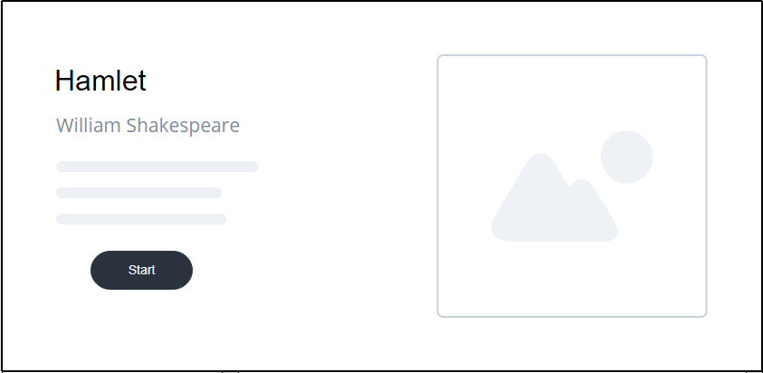
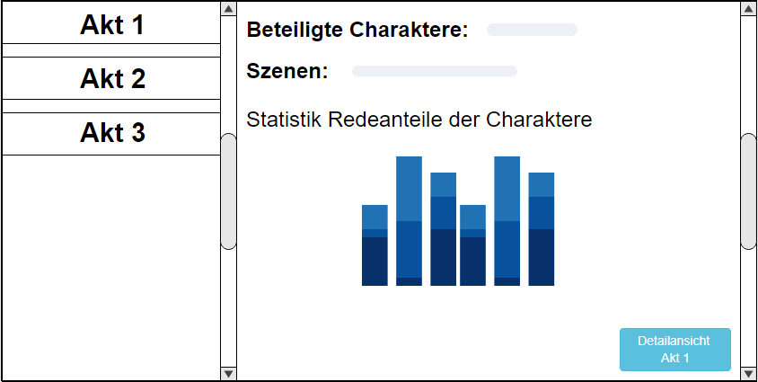
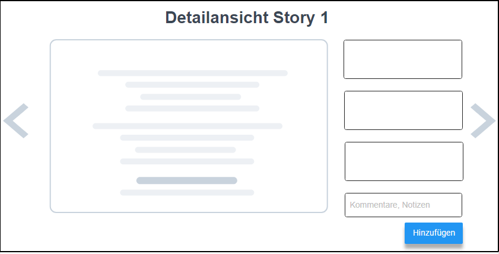

## Aufgabenstellung: Fan-Fiction-Viewer

Im Rahmen Ihres Abschlussprojektes implementieren Sie eine Webanwendung, die der Erfassung und Darstellung eines Fan-Fiction Korpus dient. Zur Implementierung des Projekts setzen Sie die im Kurs erworbenen Fähigkeiten und die dort besprochenen Technologien ein. Das Projekt muss bis zum 30. September abgegeben werden.

## Anforderungen

Das wesentliche Ziel des Projektes ist es, die im JSON-Format bereitgestellten Daten in das System einzupflegen und im Anschluss für den/die Nutzer/in – aufbereitet – zugänglich zu machen. Die zu implementierende Anwendung erfüllt dazu zwei Funktionen: 

(1) Die Informationen werden dem/der Nutzer/in strukturiert zugänglich gemacht. Als Nutzer/in können Sie einen Überblick über den Autor und Charaktere der Story, und weitere Metadaten erhalten.

(2) Über eine entsprechende graphische Schnittstelle können Nutzer/innen die Inhalte um zusätzliche Informationen ergänzen. So können Kommentare und Notizen zu den jeweiligen Fan_Fiction Inhalten hinzugefügt und in einer Datenbank persistiert werden. 

## Technischer Rahmen

Die Implementierung der Anwendung erfolgt auf der im Kurs gelernten Technologien. Die relevanten Daten werden in einer SQLite-Datenbank gespeichert. Zur Gestaltung der Benutzeroberfläche verwenden Sie HTML & CSS. Die graphische Aufbereitung auf der Übersichtsseite erfolgt mit der Javascript-Bibliothek Chart.js [http://www.chartjs.org/].  Bitte reichen Sie bei Abgabe die erstellte und befüllte Datenbank mit
ein.

## Beschreibung der Datengrundlage

Die Datenbasis umfasst den zur Verfügung gestellten Fa-Fiction Korpus im JSON-Format. Verwenden Sie zusätzlich dazu das Starter-Paket, das Sie auf GRIPS herunterladen können- 

## Skizzen der Benutzeroberfläche

Die folgenden Skizzen beschreiben die wesentlichen Bestandteile der Benutzeroberfläche. Bei
der Implementierung der Anwendung müssen Sie sich an diesen Vorgaben orientieren. Bitte
beachten Sie dabei jedoch, dass die Skizzen die Struktur und den Inhalt der Benutzeroberfläche
beschreiben, nicht zwangsläufig deren finales oder vollständiges Aussehen.

{ height=8cm }

{ height=8cm }

_Abgabekriterien:_

Laden Sie Ihre Lösung bis spätestens 30.09.2020 (23:59 Uhr) als zip-komprimierten Ordner auf GRIPS hoch.  Benennen Sie die einzelnen Dateien pro Aufgabe sinnvoll und verwenden Sie geeignete Formate:

- Aufgabe: Ihr gesamtes Projekt

Der Name der Zip-Datei ergibt sich aus dem Präfix „Projekt_WT_SS20“, der Nr. der Studienleistung, ihrem Vor- und Nachnamen jeweils getrennt durch _ .

 

Beispiel: **Projekt_WT_SS20_Max_Mustermann.zip**

