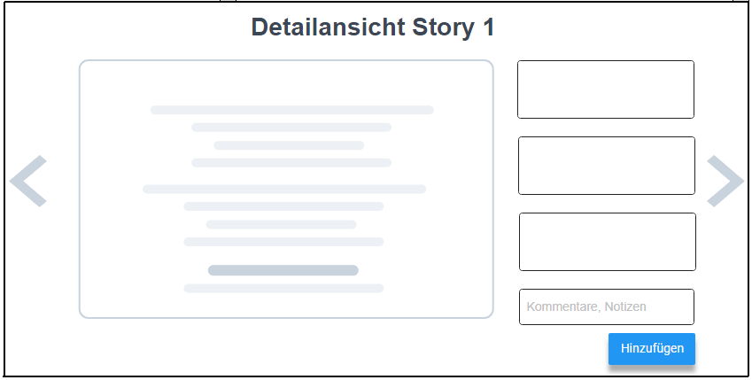

## Aufgabenstellung: Fan-Fiction-Viewer

Im Rahmen Ihres Abschlussprojektes implementieren Sie eine Webanwendung, die der Erfassung und Darstellung eines Fan-Fiction Korpus dient. Zur Implementierung des Projekts setzen Sie die im Kurs erworbenen Fähigkeiten und die dort besprochenen Technologien ein.

## Anforderungen

Das wesentliche Ziel des Projektes ist es, die im JSON-Format bereitgestellten Daten in das System einzupflegen und im Anschluss für den/die Nutzer/in – aufbereitet – zugänglich zu machen. Die zu implementierende Anwendung erfüllt dazu zwei Funktionen: 

(1) Die Informationen werden dem/der Nutzer/in strukturiert zugänglich gemacht. Als Nutzer/in können Sie einen Überblick über den Autor und Charaktere der Story, und weitere Metadaten erhalten.

(2) Über eine entsprechende graphische Schnittstelle können Nutzer/innen die Inhalte um zusätzliche Informationen ergänzen. So können Kommentare und Notizen zu den jeweiligen Fan-Fiction Inhalten hinzugefügt und in einer Datenbank persistiert werden. 

## Technischer Rahmen

Die Implementierung der Anwendung erfolgt auf der im Kurs gelernten Technologien. Die zu persistierenden Daten werden in einer SQLite-Datenbank gespeichert. Zur Gestaltung der Benutzeroberfläche verwenden Sie HTML & CSS. Die graphische Aufbereitung auf der Übersichtsseite können Sie mit der im Kurs besprochenen Javascript-Bibliothek [\textcolor{blue}{Chart.js}](http://www.chartjs.org/).  Bitte reichen Sie bei Abgabe die erstellte und befüllte Datenbank mit ein. 

Verwenden Sie das Ihnen zur Verfügung gestellte Starter-Paket, um Ihre Anwendung zu implementieren. Das Starter-Paket enthält die wesentlichen node.js Module (_index.js_, _Database.js_) sowie Module, die für die clientseitigen Funktionalitäten der Anwendung zuständig sind (_app.js_, _DatabaseClient.js_).  

## Beschreibung der Datengrundlage

Die Datenbasis umfasst das zur Verfügung gestellte Fan-Fiction Korpus im JSON-Format. Erstellen Sie zusätzlich dazu eine eigene Datenbank, die die Kommentare und Notizen zu den entsprechenden Fan-Fiction Stories abspeichert.  _Welches Feature kann man dem Nutzer noch zur Verfügung stellen, so dass er/sie Informationen generiert, die dann in der DB gespeichert werden._ 

## Skizzen der Benutzeroberfläche

Die folgenden Skizzen beschreiben die wesentlichen Bestandteile der Benutzeroberfläche. Bei
der Implementierung der Anwendung müssen Sie sich an diesen Vorgaben orientieren. Bitte
beachten Sie dabei jedoch, dass die Skizzen die Struktur und den Inhalt der Benutzeroberfläche
beschreiben, nicht zwangsläufig deren finales oder vollständiges Aussehen.

{ height=8cm }

{ height=8cm }

# Projektablauf

Sollten Sie während der Arbeit an Ihrem Projekt Fragen haben oder Hilfestellungen benötigen, kontaktieren Sie uns per Mail oder besuchen Sie unsere Sprechstunden. Versuchen Sie bei Problemen möglichst früh mit uns Kontakt aufzunehmen. Zusätzlich zu diesem freiwilligen Angebot sind diese verpflichtenden Termine wahrzunehmen:

**05. August**        Projekt-Kickoff zum Klären offener Fragen und zum Abstimmen des Vorgehens [mit Alexander Bazo]

**16. September**  Finale Besprechung des aktuellen Stands vor der Abgabe [mit Martin Kocur]

_Abgabekriterien:_

Laden Sie Ihr gesamtes Projekt (inkl. Datenbank) bis spätestens 30.09.2020 (23:59 Uhr) als zip-komprimierten Ordner auf GRIPS hoch.  Denken Sie daran, dass Sie auch mehrfach eine Lösung einreichen können und die vorherige Abgabe damit überschreiben.

Der Name der Zip-Datei ergibt sich aus dem Präfix „Projekt_WT_SS20“, der Nr. der Studienleistung, ihrem Vor- und Nachnamen jeweils getrennt durch _ .

 

Beispiel: **Projekt_WT_SS20_Max_Mustermann.zip**

