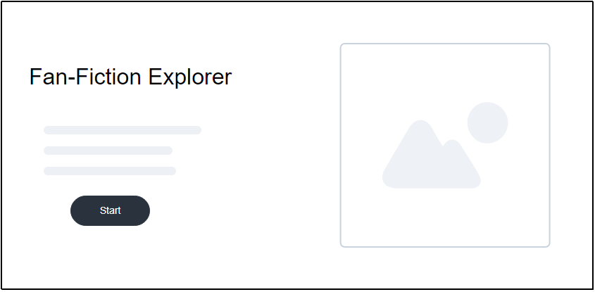
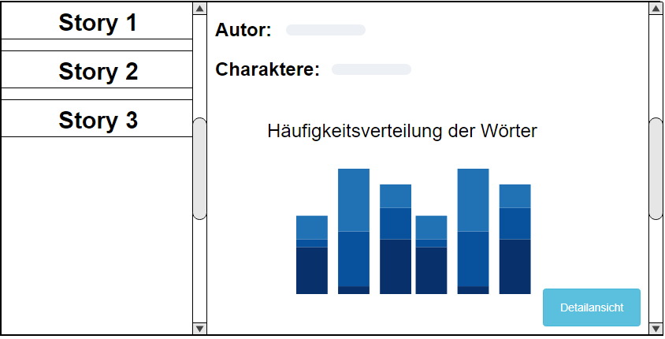

## Aufgabenstellung: Fan-Fiction-Explorer

Im Rahmen Ihres Abschlussprojektes implementieren Sie eine Webanwendung, die der Erfassung und Darstellung eines Fan-Fiction Korpus dient. Mit Hilfe der Anwendung sollen Nutzer/innen einen Überblick über die zur Verfügung gestellten Fan-Fiction Inhalte erhalten und diese bei Bedarf mit textuellen Kommentaren und Notizen ergänzen können. Zur Implementierung des Projekts setzen Sie die im Kurs erworbenen Fähigkeiten und die dort besprochenen Technologien ein. Das Projekt besteht aus zwei Teilen:

1.  Der erste Teil liefert die Datenbasis für den zweiten Teil des Projekts. Hierfür sollen Sie mit Hilfe des Skripts _Fan-Fiction Data-Importer_ eine Datenbank mit den Fan-Fiction Stories und den dazugehörigen Metadaten erstellen. Gestalten Sie ein geeignetes Datenbankschema und halten Sie sich an die im Kurs besprochenen Normalisierungsregeln (3.NF).

2. Der zweite Teil des Projekts ist die eigentliche Webanwendung, in die Sie die Datenbank einbinden und die im Folgenden beschriebenen Anforderungen implementieren.

   

## Anforderungen Teil 1

Die Anforderungen des ersten Teils des Projekts und das für Sie zur Verfügung gestellte Skript finden Sie [\textcolor{blue}{hier}](https://github.com/Webtechnologien-Regensburg/Fan-Fiction-Data-Importer).

## Anforderungen Teil 2

Das wesentliche Ziel des Projektes ist es, die bereitgestellten Daten in das System einzupflegen und im Anschluss für den/die Nutzer/in – aufbereitet – zugänglich zu machen. Die zu implementierende Anwendung erfüllt dabei zwei grundlegende Funktionen: 

1. Die Informationen werden dem/der Nutzer/in strukturiert zugänglich gemacht. Als Nutzer/in können Sie unter anderem einen Überblick über den Autor, Charaktere und den Inhalt der Geschichten erhalten.

2. Über eine entsprechende graphische Schnittstelle können Nutzer/innen die Inhalte um zusätzliche Informationen ergänzen. So können Kommentare und Notizen zu den jeweiligen Fan-Fiction Inhalten hinzugefügt und in einer Datenbank persistiert werden. 

Ihre Applikation benötigt mindestens drei Seiten:

1. Eine Startseite, die beim Start Ihrer Anwendung angezeigt wird.

2. Eine Übersichtsseite, bestehend aus einer Listenansicht, die alle Fan-Fiction Inhalte darstellt, und einer Detailansicht, die Informationen über die entsprechende Fan-Fiction Geschichte zur Verfügung stellt. Dabei sollen alle wichtigen Metadaten (z.B. Titel, Autor, Charaktere, Kategorie, Fangemeinde, Rating) in der Detailansicht angezeigt werden.

3. Eine Lese - und Kommentarseite, die die entsprechende Fan-Fiction Geschichte darstellt und es dem/der Nutzer/in ermöglicht, sich über ein Eingabefeld Notizen und Kommentare zu der jeweiligen Geschichte zu machen. Auch die vom Nutzer generierten Informationen werden auf dieser Seite angezeigt. Außerdem können Sie zwischen den einzelnen Geschichten wechseln ohne dabei zur Übersichtsseite zurückspringen zu müssen.

Orientieren Sie sich für die Gestaltung der drei Seiten an den im Folgenden dargestellten Skizzen der Benutzeroberfläche.

## Denkbare Benutzerinteraktion

1. Über die Startseite kann der/die Nutzer/in über einen Button-Klick zur Übersichtsseite gelangen.
2. Über einen Klick auf die Listenelemente erhält der/die Nutzer/in die entsprechenden Informationen zur dazugehörigen Fan-Fiction Geschichte.
3. Über einen Klick auf einen Button springt der/die Nutzer/in zur Lese-und Kommentarseite, die Eingabefelder für Kommentare und Notizen enthält.  Zusätzliche Buttons ermöglichen einen Wechsel der Geschichten.

## Skizzen der Benutzeroberfläche

Die folgenden Skizzen beschreiben die wesentlichen Bestandteile der Benutzeroberfläche. Bei
der Implementierung der Anwendung müssen Sie sich an diesen Vorgaben orientieren. Bitte
beachten Sie dabei jedoch, dass die Skizzen lediglich die Struktur und den Inhalt der Benutzeroberfläche
beschreiben, nicht aber deren finales oder vollständiges Aussehen.

{ height=8cm }

{ height=8cm }

## Beschreibung der Datengrundlage

Die Datenbasis umfasst das zur Verfügung gestellte Fan-Fiction Korpus im JSON-Format. Erstellen Sie zusätzlich dazu eine eigene Datenbank, die die textuellen Kommentare und Notizen zu den entsprechenden Fan-Fiction Stories abspeichert.

## Technischer Rahmen

Die Implementierung der Anwendung erfolgt auf der im Kurs gelernten Technologien. Die zu persistierenden Daten werden in einer SQLite-Datenbank gespeichert. Zur Gestaltung der Benutzeroberfläche verwenden Sie HTML & CSS. Die graphische Aufbereitung auf der Übersichtsseite können Sie mit der im Kurs besprochenen Javascript-Bibliothek [\textcolor{blue}{Chart.js}](http://www.chartjs.org/).  Bitte reichen Sie bei Abgabe die erstellte und befüllte Datenbank mit ein. Verwenden Sie das Ihnen zur Verfügung gestellte [\textcolor{blue}{Starter-Paket}](https://github.com/Webtechnologien-Regensburg/Projekt/tree/master/StarterPaket), um die Webanwendung zu implementieren. Das Starter-Paket enthält die wesentlichen node.js Module (_index.js_, _Database.js_) sowie Module, die für die clientseitigen Funktionalitäten der Anwendung zuständig sind (_app.js_, _DatabaseClient.js_).  

# Projektablauf

Sollten Sie während der Arbeit an Ihrem Projekt Fragen haben oder Hilfestellungen benötigen, kontaktieren Sie uns per Mail oder besuchen Sie unsere Sprechstunden. Versuchen Sie bei Problemen möglichst früh mit uns Kontakt aufzunehmen. Zusätzlich zu diesem freiwilligen Angebot sind diese verpflichtenden Termine wahrzunehmen:

**Zwischen 3. und 6. August: **	

Projekt-Kickoff zum Klären offener Fragen und zum Abstimmen des Vorgehens [mit Alexander Bazo]. 

**Zwischen 7. und 11. September **  Finale Besprechung des aktuellen Stands vor der Abgabe [mit Martin Kocur]

_Abgabekriterien:_

Laden Sie Ihr gesamtes Projekt (inkl. Datenbank) bis spätestens 30.09.2020 (23:59 Uhr) als zip-komprimierten Ordner auf GRIPS hoch.  Denken Sie daran, dass Sie auch mehrfach eine Lösung einreichen können und die vorherige Abgabe damit überschreiben.

Der Name der Zip-Datei ergibt sich aus dem Präfix „Projekt_WT_SS20“, der Nr. der Studienleistung, ihrem Vor- und Nachnamen jeweils getrennt durch _ .

 

Beispiel: **Projekt_WT_SS20_Max_Mustermann.zip**

